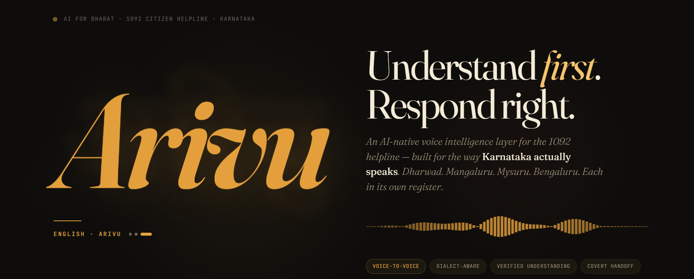
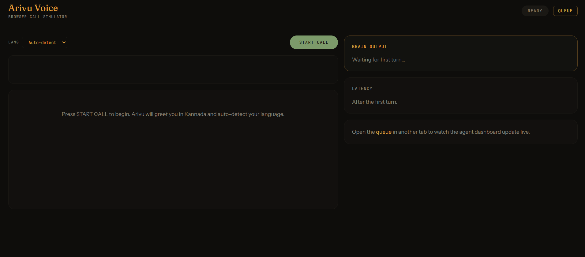
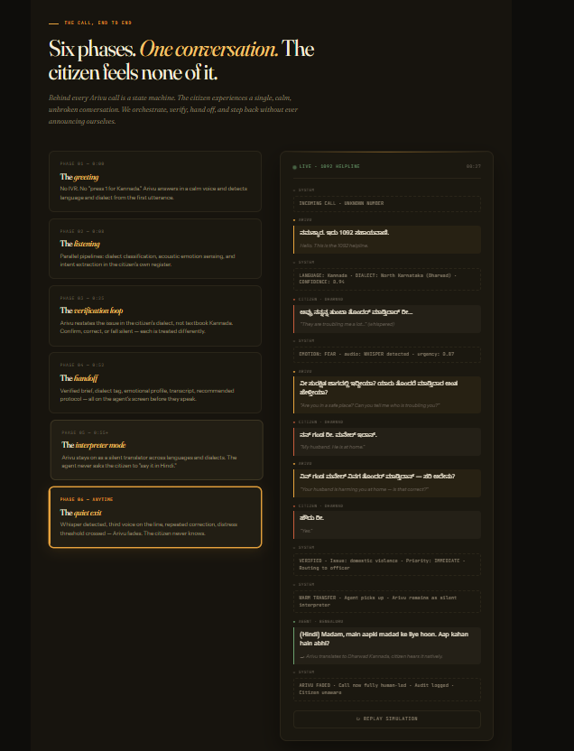

# Arivu

<p align="center">
  
</p>

<p align="center">
  <strong>Understand first. Respond right.</strong>
</p>

<p align="center">
  AI-native voice intelligence for the Karnataka 1092 helpline.
  <br />
  Built for the way people actually speak when stress, dialect, and urgency matter.
</p>

<p align="center">
  
  
  
  
  
  
</p>

<p align="center">
  
</p>

## The Pitch

Citizens do not call helplines to repeat themselves. They call to be understood once, correctly, and with dignity.

Arivu is an AI-assisted voice-to-voice layer for the Karnataka 1092 helpline. It listens to a caller, identifies language and dialect, verifies the issue in a familiar register, detects urgency or distress, and hands human officers a cleaner, faster, safer understanding of the situation.

This repo contains the working prototype for that full loop: voice in, intelligence in the middle, live dashboard out.

## Why This Feels Hackathon-Worthy

- Solves a real public-service problem where clarity can change outcomes.
- Goes beyond transcription with dialect awareness, verification, and safety escalation.
- Combines voice AI, realtime systems, human-in-the-loop review, and a polished product surface.
- Ships as a full-stack demo, not just a model endpoint.
- Has a modular architecture that can scale across districts, languages, and providers.

## What Arivu Does

- Listens to citizen speech through a browser mic flow or telephony pipeline.
- Detects Kannada register and dialect cues to reduce mistrust and repetition.
- Summarizes the issue and asks for confirmation in the caller's own speaking pattern.
- Tracks urgency, sentiment, and safety triggers such as whispers or silence after distress.
- Pushes live events to an agent dashboard for handoff, review, and correction.
- Captures human corrections to improve future system quality.

## Product Snapshots

<table>
  <tr>
    <td width="50%">
      
      <p><strong>Opening statement</strong><br />Sets the tone with a strong narrative and visual identity.</p>
    </td>
    <td width="50%">
      
      <p><strong>Browser call simulator</strong><br />Live mic demo surface for fast judging and local testing.</p>
    </td>
  </tr>
  <tr>
    <td width="50%">
      
      <p><strong>Stable core, swappable edges</strong><br />Designed so providers and models can evolve without rewriting the system.</p>
    </td>
    <td width="50%">
      
      <p><strong>End-to-end call flow</strong><br />Verification, handoff, and covert assistance all live inside one calm experience.</p>
    </td>
  </tr>
</table>

## Architecture At A Glance

Arivu is intentionally split into three product-facing services and a few supporting layers:

1. `voice/` handles real-time audio, speech-to-text, text-to-speech, and event emission.
2. `voice/voice/brain/` runs the verification logic, dialect handling, intent extraction, and safety-aware decisioning.
3. `dashboard-api/` acts as the realtime hub for events, persistence, and agent-facing data.
4. `dashboard-web/` is the human console for live monitoring, transcript review, and handoff visibility.

<p align="center">
  
</p>

## Tech Stack Snapshot

| Layer | Stack |
| --- | --- |
| Frontend | Next.js 14, React 18, TypeScript, Tailwind CSS |
| Backend APIs | FastAPI, Uvicorn, httpx, WebSockets |
| Voice + AI | Pipecat, Sarvam AI, Gemini, Google Cloud Speech-to-Text, Google Cloud Text-to-Speech |
| Communication | Twilio voice flow, browser microphone demo |
| Data + Realtime | Supabase, in-memory fallback store, correction forwarding |
| Dev Experience | `uv`, `pnpm`, Docker Compose, pytest |
| Deployment | Render for Python services, Vercel for the Next.js dashboard |

## Repo Map

```text
arivu/
|- voice/            # Voice service + brain service
|- dashboard-api/    # FastAPI hub for calls, events, corrections, websockets
|- dashboard-web/    # Next.js agent dashboard and browser talk demo
|- shared/           # Shared schemas
|- infra/            # Render and Vercel deployment configuration
|- learning_loop/    # Export and fine-tuning support scripts
```

## Quick Start

### 1. Prerequisites

- Python 3.11+
- Node.js 20+
- `pnpm`
- `uv`

### 2. Install dependencies

```bash
cd voice
uv pip install -e ".[dev]"

cd ../dashboard-api
uv pip install -e ".[dev]"

cd ../dashboard-web
pnpm install
```

### 3. Configure environment

Copy the template and fill in keys for Sarvam, Gemini, Supabase, and Twilio:

```bash
cp .env.example .env
```

### 4. Run locally

If `make` is available:

```bash
make dev
```

If you prefer separate terminals:

```bash
cd voice
uv run uvicorn voice.main:app --host 0.0.0.0 --port 8000 --reload
```

```bash
cd voice
uv run uvicorn voice.brain.main:app --host 0.0.0.0 --port 8002 --reload
```

```bash
cd dashboard-api
uv run uvicorn dashboard_api.main:app --host 0.0.0.0 --port 8001 --reload
```

```bash
cd dashboard-web
pnpm dev
```

## Local Endpoints

| Surface | URL |
| --- | --- |
| Voice health | `http://localhost:8000/health` |
| Browser audio turn | `http://localhost:8000/web/turn` |
| Brain health | `http://localhost:8002/health` |
| Dashboard API | `http://localhost:8001/health` |
| Agent dashboard | `http://localhost:3000` |
| Browser talk demo | `http://localhost:3000/talk` |
| Queue view | `http://localhost:3000/queue` |

## Testing

Run the full backend test suite:

```bash
make test
```

Or run service-specific suites:

```bash
cd voice && uv run pytest tests/ -v
cd dashboard-api && uv run pytest tests/ -v
```

## Why The Design Matters

Arivu is not trying to replace the officer. It is trying to remove friction before the officer takes over.

The value is in the sequence:

- listen carefully
- interpret safely
- verify in the caller's register
- escalate when the signal feels wrong
- hand off with context, not chaos

That makes it useful not only as a demo, but as a serious public-facing AI system pattern.

## Next Steps

- Expand dialect coverage beyond the current Kannada-focused prototype.
- Add stronger judge-facing demo scripts with replayable call scenarios.
- Store correction history for fine-tuning and post-call evaluation.
- Harden telephony deployment with production-grade observability and retry paths.

## Closing Note

Arivu is built around a simple belief: in emergency and support systems, understanding is not a luxury feature. It is the product.
